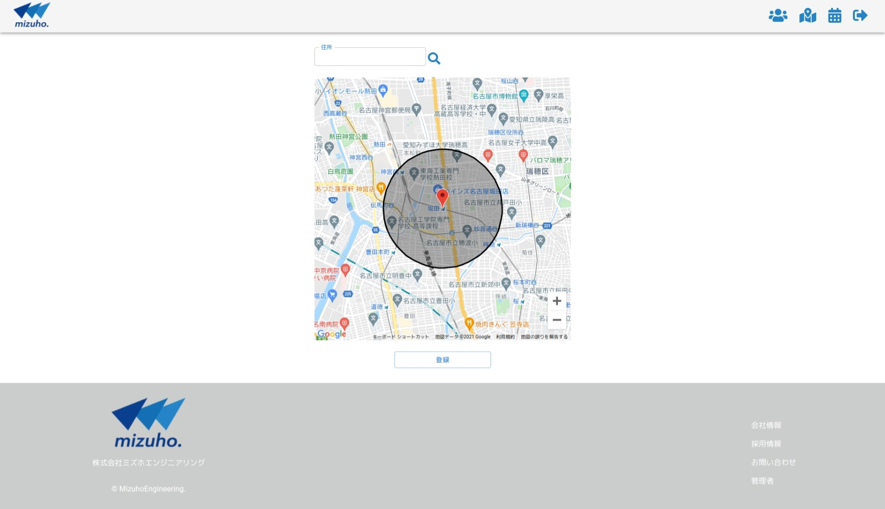
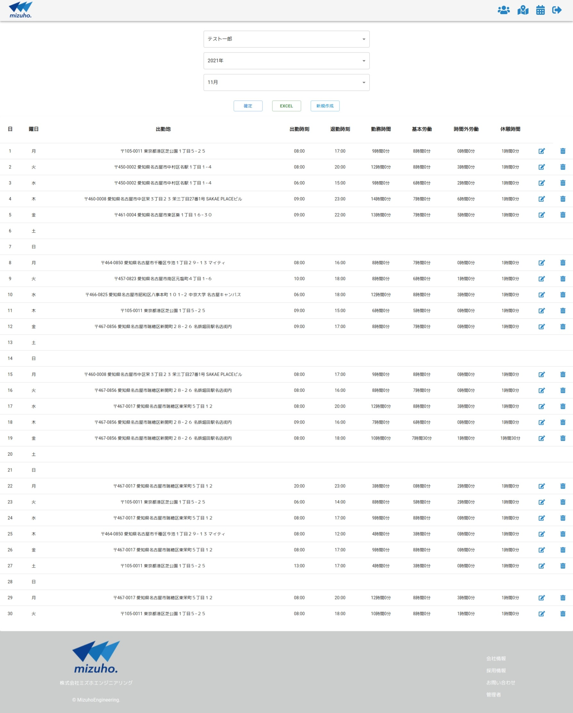

# ミズホエンジニアリング勤怠管理システム

## 概要

こちらは株式会社ミズホエンジニアリングで現在使用している勤怠管理システムです。

現場へ直行直帰の多い土木仕事のため位置情報を利用出来るよう開発しました。

↓バックエンドのリポジトリ

[https://github.com/KantaHasegawa/MizuhoEngineeringTimecardSystem-BackEnd](https://github.com/KantaHasegawa/MizuhoEngineeringTimecardSystem-BackEnd "https://github.com/KantaHasegawa/MizuhoEngineeringTimecardSystem-BackEnd")

## 使用技術

フロントにNext.js、バックエンドにExpress、インフラはServerlessFrameworkを使ってLambda + APIGateway + DynamoDBの構成で構築しています。

## Versions

npm list --depth 0  

├── @fortawesome/free-solid-svg-icons@5.15.4
├── @fortawesome/react-fontawesome@0.1.16
├── @line/bot-sdk@7.4.0
├── @types/bcrypt@5.0.0
├── @types/cookie-parser@1.4.2
├── @types/cors@2.8.12
├── @types/csurf@1.11.2
├── @types/express-session@1.17.4
├── @types/express@4.17.13
├── @types/jest@27.0.3
├── @types/jsonwebtoken@8.5.6
├── @types/node-geocoder@3.24.3
├── @types/node@16.11.10
├── @types/sinon-express-mock@1.3.9
├── @types/supertest@2.0.11
├── @types/xlsx-populate@1.19.1 (git+ssh://git@github.com/JanLoebel/types-xlsx-populate.git#7ef81174e495fe9ef2689bd329499f81a2a93d43)
├── @typescript-eslint/eslint-plugin@5.4.0
├── @typescript-eslint/parser@5.4.0
├── @vendia/serverless-express@4.5.2
├── ajv@6.12.6
├── aws-sdk@2.1036.0
├── bcrypt@5.0.1
├── body-parser@1.19.0
├── cookie-parser@1.4.6
├── cors@2.8.5
├── csurf@1.11.0
├── dayjs@1.10.7
├── eslint-config-prettier@8.3.0
├── eslint@8.3.0
├── express-validator@6.13.0
├── express@4.17.1
├── faker@5.5.3
├── geo-position.ts@1.4.1
├── jest@27.3.1
├── jsonwebtoken@8.5.1
├── node-geocoder@3.28.0
├── nodemon@2.0.15
├── npm-run-all@4.1.5
├── prettier@2.4.1
├── rimraf@3.0.2
├── serverless-plugin-typescript@2.1.0
├── sinon-express-mock@2.2.1
├── sinon@11.1.2
├── supertest@6.1.6
├── ts-jest@27.0.7
├── ts-node-dev@1.1.8
├── ts-node@10.4.0
├── typescript@4.5.2  
└── xlsx-populate@1.21.0
